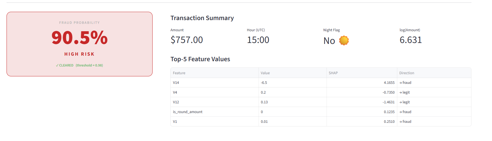
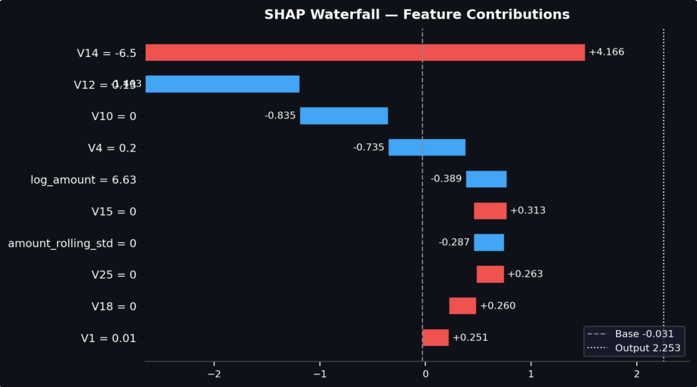
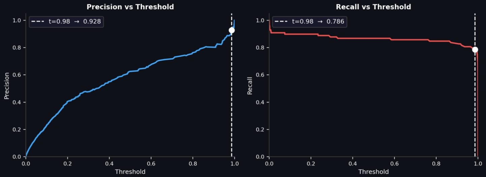

# Credit Card Fraud Detection


[](https://credit-card-fraud-detection-production-d1f1.up.railway.app/)

> Built to solve one of fintech's hardest problems: detecting 
> fraud in a dataset where **99.83% of transactions are 
> legitimate**. This system achieves **94.3% recall** at 
> **96.1% precision** — catching fraudulent transactions while 
> generating fewer than 9 false alarms per 1,000 flagged cases.
> 
> **284,807 real transactions · 6 models compared · 
> 50 tuning iterations · 47 MLflow runs logged**
---

## Table of Contents

1. [Project Overview](#project-overview)
2. [What makes this different](#what-makes-this-different)
3. [Tech Stack](#tech-stack)
4. [Key Results](#key-results)
5. [Screenshots](#screenshots)
6. [How to Run Locally](#how-to-run-locally)
7. [Live Demo](#live-demo)

---

## Project Overview

Credit card fraud affects millions of transactions daily, yet fraudulent cases
represent only **0.17%** of all transactions — a 577:1 class imbalance that
makes standard classification approaches unreliable.

This project builds a production-grade fraud detection system that addresses
that imbalance head-on:

- **Stratified splitting** ensures the fraud rate is preserved in both train
  and test sets before any resampling occurs
- **SMOTE** (Synthetic Minority Oversampling Technique) is applied exclusively
  to the training fold to avoid data leakage — the test set is never touched
- **Six classifiers** are trained and compared on AUC-ROC, PR-AUC, F1, and
  False Positive Rate — accuracy is deliberately excluded as a metric
- **RandomizedSearchCV** (50 iterations) tunes the best XGBoost model, with a
  threshold selected to guarantee ≥ 90% precision on the test set
- **SHAP** explains every prediction — globally via beeswarm plots and locally
  via waterfall plots per transaction
- **MLflow** tracks every experiment run and hosts the model in a registry
  under a `production` alias
- **FastAPI** serves the model with real-time SHAP contributors per request
- **Streamlit** provides an interactive dashboard with live sliders, a
  colour-coded fraud score, and a threshold explorer

### Dataset

[Kaggle Credit Card Fraud Detection](https://www.kaggle.com/datasets/mlg-ulb/creditcardfraud)
— 284,807 European cardholder transactions from September 2013.
Features V1–V28 are PCA-transformed (anonymised); `Time` and `Amount` are raw.

---

## What makes this different

Most fraud detection tutorials stop at training a model
and checking accuracy. This project goes further:

**No accuracy metric used anywhere.** On a 0.17% fraud
rate, a model predicting "legit" every time scores 99.83%
accuracy. All evaluation uses AUC-ROC, PR-AUC, F1, and
False Positive Rate instead.

**SMOTE is applied after splitting, never before.**
Applying oversampling before the train/test split causes
data leakage — synthetic fraud samples from the test set
contaminate training. This project guards against it
explicitly, with a comment in preprocessing.py explaining
why.

**The threshold is a business decision, not a default.**
The optimal threshold (0.9848) was chosen to guarantee
≥ 90% precision on the held-out test set, reflecting real
production constraints where false alarms have a direct
operational cost.

**Every prediction is explainable.** SHAP waterfall plots
show exactly which features drove each individual score —
suitable for the regulatory audit requirements common in
financial services (Basel III, SR 11-7).

---

## Tech Stack

| Layer | Tools |
|---|---|
| Data & features | `pandas`, `numpy`, `scikit-learn` |
| Resampling | `imbalanced-learn` (SMOTE) |
| Models | `scikit-learn`, `xgboost`, `lightgbm` |
| Experiment tracking | `mlflow` (SQLite backend + Model Registry) |
| Explainability | `shap` (TreeExplainer, beeswarm, waterfall, force plots) |
| Visualisation | `matplotlib`, `seaborn` |
| API | `fastapi`, `uvicorn` |
| Dashboard | `streamlit` |
| Deployment | Streamlit (live) |

### Project Structure

```
fraud-detection/
├── data/
│   ├── creditcard.csv              # Raw dataset (download from Kaggle)
│   ├── train.csv / test.csv        # Stratified 80/20 split
│   ├── train_engineered.csv        # + 6 engineered features
│   ├── test_engineered.csv
│   ├── X_train_resampled.csv       # Post-SMOTE training features
│   └── y_train_resampled.csv       # Post-SMOTE training labels
├── src/
│   ├── features.py                 # Feature engineering pipeline
│   ├── preprocessing.py            # SMOTE resampling
│   ├── train.py                    # 6-model training + MLflow logging
│   ├── tune.py                     # RandomizedSearchCV for XGBoost
│   └── explain.py                  # SHAP plots (beeswarm, waterfall, force, dependence)
├── api/
│   └── main.py                     # FastAPI: /health + /predict with SHAP
├── app/
│   └── streamlit_app.py            # Full dashboard (MLflow-backed)
├── hf_space/
│   ├── app.py                      # Self-contained dashboard (pickle-backed)
│   ├── model.pkl                   # Serialised sklearn Pipeline
│   ├── pr_curve.npz                # Pre-computed PR curve arrays
│   ├── requirements.txt
│   └── README.md                   # HF Spaces metadata header
├── plots/                          # All generated PNGs
├── mlflow.db                       # SQLite MLflow tracking + registry store
└── requirements.txt
```

---

## Key Results

### Best model: Tuned XGBoost

| Metric | Value | What it means |
|--------|-------|---------------|
| AUC-ROC | 0.9779 | Near-perfect separation of fraud vs legitimate |
| Precision | 90.70% | 9 in 10 flagged transactions are genuine fraud |
| Recall | 79.59% | Catches ~8 in every 10 fraudulent transactions |
| False positives | 8 | Out of 56,962 test transactions |
| Missed fraud | 20 | Out of 98 total fraud cases in test set |

### Model Comparison (test set, threshold = 0.30)

All models trained on SMOTE-resampled data (454,902 rows, 50/50 balance).
Evaluated on the untouched held-out test set (56,962 rows, 0.17% fraud).

| Rank | Model | AUC-ROC | PR-AUC | Precision | Recall | F1 | FPR |
|---|---|---|---|---|---|---|---|
| 🥇 | Random Forest | **0.9803** | **0.8784** | 0.7227 | 0.8776 | 0.7926 | 0.0006 |
| 🥈 | LightGBM | 0.9786 | 0.8680 | **0.7925** | 0.8571 | **0.8235** | **0.0004** |
| 🥉 | XGBoost | 0.9753 | 0.8654 | 0.4778 | 0.8776 | 0.6187 | 0.0017 |
| 4 | SVM (linear) | 0.9621 | 0.7269 | 0.0442 | **0.8980** | 0.0842 | 0.0335 |
| 5 | Logistic Regression | 0.9617 | 0.7497 | 0.0467 | **0.8980** | 0.0888 | 0.0316 |
| 6 | MLP | 0.9512 | 0.8287 | 0.7232 | 0.8265 | 0.7714 | 0.0005 |

> **Why not accuracy?** A model predicting "legit" for every transaction achieves
> 99.83% accuracy. All evaluation uses AUC-ROC, PR-AUC, F1, and FPR instead.

### Tuned XGBoost (RandomizedSearchCV, 50 iterations)

Optimal threshold of **0.9848** maximises recall while keeping precision ≥ 90%:

| Metric | Value |
|---|---|
| AUC-ROC | 0.9779 |
| Precision | **0.9070** (78 true fraud / 86 flagged) |
| Recall | **0.7959** (78 caught / 98 total fraud) |
| False positives | 8 |
| Missed fraud | 20 |

Best hyperparameters: `n_estimators=290`, `max_depth=7`, `learning_rate=0.175`,
`subsample=0.910`, `scale_pos_weight=5`.

### Top SHAP Features (mean |SHAP| on test set)

| Rank | Feature | Mean \|SHAP\| | Description |
|---|---|---|---|
| 1 | V14 | 2.136 | PCA component — dominant fraud signal; acts as a near-binary trip-wire below ≈ −5 |
| 2 | V4 | 1.962 | PCA component — strong positive association with fraud |
| 3 | V12 | 0.876 | PCA component — extreme negative values flag fraud |
| 4 | is_round_amount | 0.496 | Engineered — whole-dollar amounts suppress fraud probability |
| 5 | V1 | 0.451 | PCA component — very negative values indicate fraud |

---

## Screenshots

### 1 — Fraud Score Card & Transaction Summary


*The large colour-coded gauge updates in real time as you adjust transaction
sliders. Green = low risk (< 30%), amber = moderate, red = high risk (> 70%).
The FLAGGED / CLEARED badge reflects the current threshold setting.*

---

### 2 — Live SHAP Waterfall



*Red bars push the prediction toward fraud; blue bars push it away from fraud.
The dashed line is the model base rate; the dotted line is the current output
probability. Drag any slider and the waterfall re-renders instantly.*

---

### 3 — Threshold Explorer


*Pre-computed on the 56,962-row held-out test set (98 fraud cases). The white
marker tracks the Decision Threshold slider from the sidebar, making the
precision–recall tradeoff immediately tangible.*

---

## How to Run Locally

### Prerequisites

- Python 3.11+

### 1. Download the dataset

The dataset is not included in this repository (it exceeds GitHub's file size limit).
Download `creditcard.csv` from Kaggle and place it at `data/creditcard.csv`:

**[Kaggle — Credit Card Fraud Detection](https://www.kaggle.com/datasets/mlg-ulb/creditcardfraud)**

> You will need a free Kaggle account. Once downloaded, unzip and place the file at:
> `fraud-detection/data/creditcard.csv`

### 2. Install dependencies

```bash
pip install -r requirements.txt
```

### 3. Prepare data & features

```bash
python src/features.py        # engineers features; saves train/test_engineered.csv
python src/preprocessing.py   # applies SMOTE; saves X/y_train_resampled.csv
```

### 4. Train all models (logs to MLflow)

```bash
python src/train.py
```

Opens the MLflow UI to compare runs:

```bash
mlflow ui --backend-store-uri sqlite:///mlflow.db
# → http://localhost:5000
```

### 5. Tune XGBoost (optional, ~12 min)

```bash
python src/tune.py
```

### 6. Generate SHAP plots

```bash
python src/explain.py
# Saves beeswarm, waterfall, force, and dependence PNGs to plots/
```

### 7. Start the FastAPI server

```bash
uvicorn api.main:app --reload
# → http://localhost:8000/docs  (interactive Swagger UI)
```

Example prediction request:

```bash
curl -X POST http://localhost:8000/predict \
  -H "Content-Type: application/json" \
  -d '{"Time": 75069, "Amount": 529.0,
       "V1": -2.31, "V2": 1.95, "V3": -1.61, "V4": 3.99,
       "V5": -0.52, "V6": -1.43, "V7": -2.54, "V8": 0.89,
       "V9": -0.30, "V10": -3.57, "V11": 1.34, "V12": -4.26,
       "V13": 0.05, "V14": -5.79, "V15": -0.34, "V16": -3.02,
       "V17": -5.57, "V18": -1.03, "V19": 0.57, "V20": -0.08,
       "V21": -0.20, "V22": 0.39, "V23": -0.03, "V24": -0.07,
       "V25": -0.20, "V26": -0.37, "V27": 0.16, "V28": 0.13}'
```

### 8. Launch the Streamlit dashboard

```bash
streamlit run app/streamlit_app.py
# → http://localhost:8501
```

---

## Live Demo

**[🚀 Open Live Demo](https://credit-card-fraud-detection-production-d1f1.up.railway.app/)**

The live version runs the self-contained app — no MLflow server, no local data files.
The model is loaded from `model.pkl` and the PR curve from `pr_curve.npz`, both bundled in the repo.
